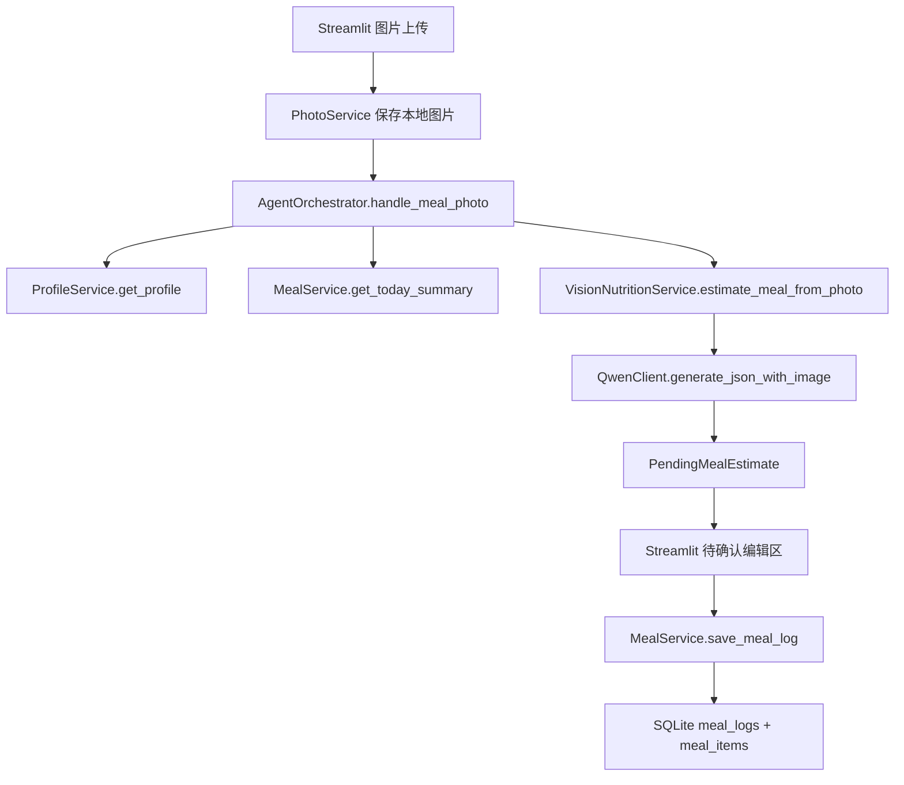

# 饮食照片输入功能设计

## 背景

当前 MVP 已经跑通纯文本饮食记录：用户输入自然语言，Orchestrator 读取档案和今日摘要，调用 Qwen 文本模型生成 `PendingMealEstimate`，页面允许用户手动修正后再保存到 SQLite。

这次新增图片识别，不改变“先估算、再确认、最后落库”的核心交互。照片只是新的输入来源，识别结果仍然复用现有的待确认餐食结构和编辑界面。

## 目标

1. 聊天式记录页支持上传一张餐食照片，并可附加一句文字说明。
2. 系统把图片保存到本地 `fat_loss_agent/data/photos/`，SQLite 只保存图片路径，不保存图片二进制。
3. Qwen 视觉模型返回与文本估算一致的 `PendingMealEstimate` JSON。
4. 用户必须确认保存，且可以在保存前手动修正餐次、标题、营养值和食物明细。
5. 保存后的餐食记录能区分文本输入和照片输入，并保留照片路径，便于后续复盘或排错。
6. Trace 记录图片识别链路使用过的工具、模型和错误状态。

## 非目标

1. 不做多图批量识别。
2. 不做自动保存。
3. 不引入 LangGraph、异步任务队列、独立后端或多 Agent。
4. 不新增图片营养数据库，第一版只依赖多模态 LLM 估算。

## 架构

新增一个很薄的图片链路：

文本链路保持不变。图片链路只在输入端和 LLM 调用方式上不同，保存端复用 `MealService` 和 `MealRepository`。

## 数据模型

`meal_logs` 增加两个字段：

- `input_type TEXT NOT NULL DEFAULT 'text'`：取值先使用 `text` 或 `photo`。
- `photo_path TEXT NOT NULL DEFAULT ''`：本地照片路径；文本记录为空字符串。

`init_db()` 需要对已有 SQLite 文件做轻量迁移：表存在但缺少字段时，用 `ALTER TABLE` 补列。这样用户已有数据不会因为升级 schema 而丢失。

## 服务边界

- `PhotoService`：负责校验扩展名、生成安全文件名、保存 bytes 到 `data/photos`，不调用 LLM，不写 SQLite。
- `VisionNutritionService`：负责组装图片识别 prompt、调用支持图片的 LLM client、校验返回 JSON。
- `QwenClient.generate_json_with_image()`：用 OpenAI-compatible 消息格式发送文字 prompt 和 base64 data URL 图片。
- `AgentOrchestrator.handle_meal_photo()`：编排档案、今日摘要、视觉估算和 trace 记录。

## 配置

新增 `QWEN_VISION_MODEL`。如果未配置，则暂时复用 `QWEN_MODEL`。实际运行时建议把 `QWEN_VISION_MODEL` 设置成当前 DashScope/OpenAI-compatible 可用的 Qwen 视觉模型。

不修改用户本地已有的 `.env.example` 密钥内容；配置说明放在本设计文档和代码默认逻辑中。

## 错误处理

- 未配置 Qwen API key：页面显示现有缺 key 错误。
- 图片扩展名不支持：页面显示上传错误，不进入识别。
- 视觉模型返回非 JSON 或 schema 不合规：不保存餐食，trace 记录 error，页面显示失败原因。
- 识别置信度低：仍允许进入确认编辑区，由用户决定是否修正保存。

## 测试策略

1. DB 测试确认新列存在，且重复 `init_db()` 不报错。
2. `PhotoService` 测试确认图片保存到目标目录，文件名安全且保留扩展名。
3. `MealService`/`MealRepository` 测试确认照片记录会保存 `input_type='photo'` 和 `photo_path`。
4. `VisionNutritionService` 测试用 fake LLM 验证图片路径会传给 `generate_json_with_image()`，返回 JSON 会被校验成 `PendingMealEstimate`。
5. Orchestrator 测试确认 `handle_meal_photo()` 返回 pending meal，并记录 `meal_photo_log` trace。
6. 最后运行全量 `pytest`，再启动 Streamlit 做一次页面烟测。
